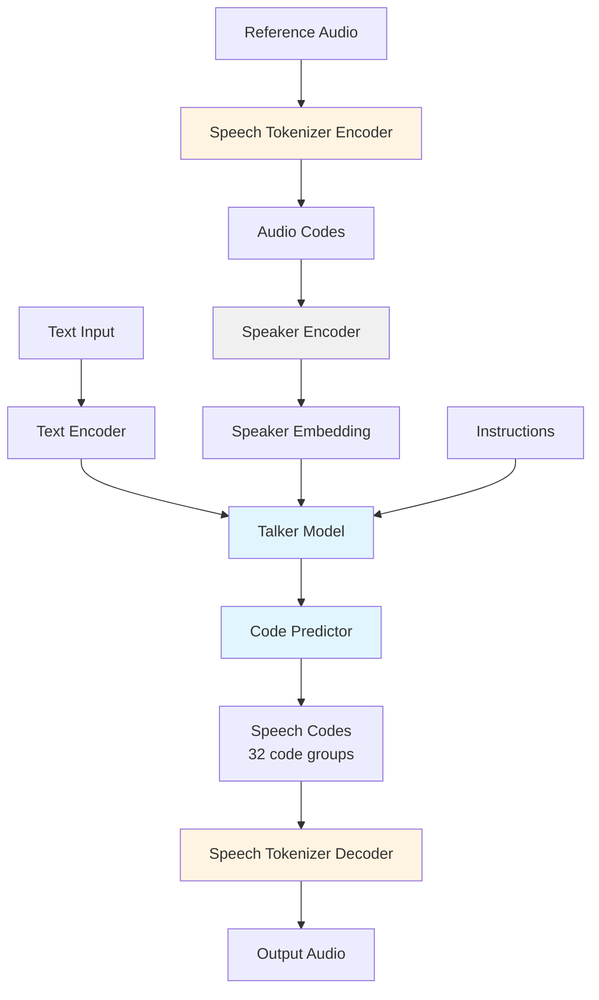

## Overview

Qwen3-TTS employs an innovative architecture that combines powerful speech representation, universal end-to-end modeling, and ultra-low-latency streaming capabilities. The system is built on three key technological pillars that work together to deliver high-quality, real-time speech synthesis.

## Key Architectural Components

### 1. Speech Tokenizer (Qwen3-TTS-Tokenizer-12Hz)

The foundation of Qwen3-TTS is its self-developed speech tokenizer, which achieves:

- **Efficient Acoustic Compression**: Compresses speech signals at 12Hz frame rate (12 frames per second)
- **Multi-Codebook Quantization**: Uses 16 residual vector quantizers for fine-grained audio reconstruction
- **Full Information Preservation**: Maintains paralinguistic information and acoustic environmental features
- **High-Fidelity Reconstruction**: Enables high-speed, high-quality speech reconstruction through a lightweight non-DiT architecture

The tokenizer consists of:
- **Encoder**: Based on Mimi architecture, converts raw audio into discrete codes
- **Decoder**: Autoregressive transformer with sliding window attention that reconstructs audio from codes
- **Sample Rate**: 24kHz input/output with 1920x compression ratio

### 2. Language Model Architecture

Qwen3-TTS uses a **discrete multi-codebook LM architecture** for end-to-end speech modeling:

#### Main Components

**Talker Model** (`Qwen3TTSTalker`)
- Transformer-based language model that generates speech codes
- Uses Grouped Query Attention (GQA) for efficient processing
- Supports sliding window attention for long sequences
- Integrates text and speaker information for conditional generation

**Code Predictor** (`Qwen3TTSTalkerCodePredictor`)
- Predicts multi-codebook speech tokens autoregressively
- Handles 32 code groups for parallel generation
- Uses RoPE (Rotary Position Embeddings) for positional encoding

**Speaker Encoder** (`Qwen3TTSSpeakerEncoder`)
- Based on ECAPA-TDNN architecture
- Extracts speaker embeddings from reference audio
- Supports voice cloning and speaker conditioning
- Uses attentive statistics pooling for robust speaker representations

### 3. Dual-Track Hybrid Streaming Generation

Qwen3-TTS features an innovative streaming architecture:

- **Single Model, Dual Mode**: One model supports both streaming and non-streaming generation
- **Immediate Response**: Can output the first audio packet after processing a single character
- **Ultra-Low Latency**: End-to-end synthesis latency as low as 97ms
- **Real-Time Interactive**: Meets rigorous demands of real-time conversational scenarios

This architecture uses:
- **Thinking Tokens**: Special tokens (`codec_think_id`, `codec_nothink_id`) control streaming behavior
- **Incremental Decoding**: Generates speech codes progressively as text arrives
- **Chunked Processing**: Balances latency and quality through adaptive chunk sizes

## Architectural Advantages

<CardGroup cols={2}>
  <Card title="No Information Bottleneck" icon="infinity">
    The end-to-end discrete multi-codebook LM architecture completely bypasses information bottlenecks and cascading errors inherent in traditional LM+DiT schemes.
  </Card>
  
  <Card title="Universal Architecture" icon="cube">
    Single unified architecture handles voice clone, voice design, custom voice, and instruction-based control without model switching.
  </Card>
  
  <Card title="Efficient Generation" icon="bolt">
    Lightweight non-DiT architecture enables high-speed inference while maintaining high-fidelity output quality.
  </Card>
  
  <Card title="Streaming Ready" icon="water">
    Built-in support for streaming generation with minimal latency overhead, ideal for real-time applications.
  </Card>
</CardGroup>

## How Components Work Together

### Generation Pipeline

1. **Input Processing**
   - Text is tokenized and encoded
   - Reference audio (if provided) is encoded into discrete codes
   - Speaker embeddings are extracted from reference audio

2. **Conditional Generation**
   - Talker model combines text, speaker, and instruction information
   - Code predictor generates speech codes autoregressively
   - Multi-codebook structure allows parallel generation of acoustic details

3. **Audio Synthesis**
   - Speech tokenizer decoder converts codes back to waveform
   - Upsampling layers reconstruct 24kHz audio
   - ConvNeXt blocks refine audio quality

4. **Streaming Mode** (Optional)
   - Incremental text input triggers progressive code generation
   - First audio chunk available within ~97ms
   - Continuous streaming until text completion

## Model Variants

Qwen3-TTS offers different model sizes with the same architecture:

| Size | Parameters | Use Case |
|------|------------|----------|
| 1.7B | ~1.7 billion | Maximum quality, full features |
| 0.6B | ~600 million | Faster inference, balanced quality |

All variants share the same architectural design and differ only in model capacity.

## Technical Specifications

### Model Configuration

- **Hidden Size**: 1024 (0.6B) / 1536 (1.7B)
- **Attention Heads**: 16
- **Key-Value Heads**: 2 (Grouped Query Attention)
- **Hidden Layers**: 20 (talker model)
- **Code Groups**: 32 parallel codebook groups
- **Vocabulary Size**: 3072 (text tokens) + 2048 (audio codes per codebook)
- **Position Embeddings**: RoPE with θ=10000

### Tokenizer Configuration

- **Encoder**: 16 quantizers, 2048 codebook size
- **Decoder**: 8 transformer layers with sliding window attention (window=72)
- **Sample Rate**: 24kHz
- **Frame Rate**: 12Hz (12 frames per second)
- **Compression Ratio**: 1920x (24000 samples/sec ÷ 12 frames/sec ÷ 16 quantizers ≈ 125 samples per code)

## Next Steps

<CardGroup cols={2}>
  <Card title="Available Models" icon="layer-group" href="/concepts/models">
    Explore the different model variants and their capabilities
  </Card>
  
  <Card title="Speech Tokenizer" icon="waveform-lines" href="/concepts/tokenizer">
    Learn about the tokenizer's encode/decode process
  </Card>
  
  <Card title="Language Support" icon="globe" href="/concepts/languages">
    Discover supported languages and multilingual features
  </Card>
  
  <Card title="Quick Start" icon="rocket" href="/quickstart/installation">
    Start using Qwen3-TTS in your project
  </Card>
</CardGroup>