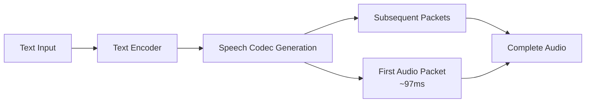

Qwen3-TTS features **Dual-Track hybrid streaming generation** architecture, enabling streaming and non-streaming generation from a single model. Achieve end-to-end synthesis latency as low as **97ms** for real-time interactive applications.

## Overview

Streaming generation allows you to:
- Start receiving audio immediately after input
- Achieve 97ms first-packet latency
- Support real-time conversational AI applications
- Process long-form content efficiently
- Maintain high audio quality during streaming

<Note>
All Qwen3-TTS models support streaming generation out of the box. No special configuration required.
</Note>

## Streaming Support by Model

| Model | Streaming Support | First Packet Latency |
|-------|-------------------|---------------------|
| Qwen3-TTS-12Hz-1.7B-CustomVoice | ✅ Yes | ~97ms |
| Qwen3-TTS-12Hz-0.6B-CustomVoice | ✅ Yes | ~97ms |
| Qwen3-TTS-12Hz-1.7B-VoiceDesign | ✅ Yes | ~97ms |
| Qwen3-TTS-12Hz-1.7B-Base | ✅ Yes | ~97ms |
| Qwen3-TTS-12Hz-0.6B-Base | ✅ Yes | ~97ms |

## How Streaming Works

Qwen3-TTS uses a **Dual-Track hybrid architecture** that:

1. **Processes text incrementally** - Generates audio codes as text is processed
2. **Outputs first audio packet immediately** - Can output after a single character input
3. **Maintains consistency** - Same model handles both streaming and non-streaming
4. **Optimizes latency** - Avoids information bottlenecks of traditional LM+DiT schemes

<Frame>

</Frame>

## Enabling Streaming Mode

Set `non_streaming_mode=False` to enable streaming behavior:

```python
import torch
import soundfile as sf
from qwen_tts import Qwen3TTSModel

model = Qwen3TTSModel.from_pretrained(
    "Qwen/Qwen3-TTS-12Hz-1.7B-CustomVoice",
    device_map="cuda:0",
    dtype=torch.bfloat16,
    attn_implementation="flash_attention_2",
)

# Streaming generation
wavs, sr = model.generate_custom_voice(
    text="Hello, this is a streaming generation test.",
    language="English",
    speaker="Ryan",
    non_streaming_mode=False,  # Enable streaming
)

sf.write("output.wav", wavs[0], sr)
```

<Info>
Currently, `non_streaming_mode=False` simulates streaming behavior but processes the complete text input. True character-by-character streaming input will be supported in a future update.
</Info>

## Streaming with Different Models

### CustomVoice Streaming

```python
import torch
from qwen_tts import Qwen3TTSModel

model = Qwen3TTSModel.from_pretrained(
    "Qwen/Qwen3-TTS-12Hz-1.7B-CustomVoice",
    device_map="cuda:0",
    dtype=torch.bfloat16,
    attn_implementation="flash_attention_2",
)

# Low-latency streaming
wavs, sr = model.generate_custom_voice(
    text="Welcome to our customer service. How may I help you today?",
    language="English",
    speaker="Ryan",
    non_streaming_mode=False,
)
```

### VoiceDesign Streaming

```python
import torch
from qwen_tts import Qwen3TTSModel

model = Qwen3TTSModel.from_pretrained(
    "Qwen/Qwen3-TTS-12Hz-1.7B-VoiceDesign",
    device_map="cuda:0",
    dtype=torch.bfloat16,
    attn_implementation="flash_attention_2",
)

wavs, sr = model.generate_voice_design(
    text="This is a real-time voice generation test.",
    language="English",
    instruct="Male, professional news anchor, clear and authoritative",
    non_streaming_mode=False,
)
```

### Base Model Streaming

```python
import torch
from qwen_tts import Qwen3TTSModel

model = Qwen3TTSModel.from_pretrained(
    "Qwen/Qwen3-TTS-12Hz-1.7B-Base",
    device_map="cuda:0",
    dtype=torch.bfloat16,
    attn_implementation="flash_attention_2",
)

ref_audio = "https://qianwen-res.oss-cn-beijing.aliyuncs.com/Qwen3-TTS-Repo/clone.wav"
ref_text = "Okay. Yeah. I resent you. I love you. I respect you. But you know what? You blew it! And thanks to you."

wavs, sr = model.generate_voice_clone(
    text="This message is being generated in real-time with minimal latency.",
    language="English",
    ref_audio=ref_audio,
    ref_text=ref_text,
    non_streaming_mode=False,
)
```

## Real-Time Application Examples

### Interactive Voice Assistant

```python
import torch
from qwen_tts import Qwen3TTSModel
import sounddevice as sd

model = Qwen3TTSModel.from_pretrained(
    "Qwen/Qwen3-TTS-12Hz-1.7B-CustomVoice",
    device_map="cuda:0",
    dtype=torch.bfloat16,
    attn_implementation="flash_attention_2",
)

def speak(text: str):
    """Generate and play speech with low latency"""
    wavs, sr = model.generate_custom_voice(
        text=text,
        language="Auto",
        speaker="Ryan",
        non_streaming_mode=False,  # Streaming for low latency
    )
    
    # Play audio immediately
    sd.play(wavs[0], sr)
    sd.wait()

# Real-time responses
speak("Hello! How can I assist you today?")
speak("I'm processing your request now.")
speak("Here are the results you requested.")
```

### Live Commentary System

```python
import torch
from qwen_tts import Qwen3TTSModel
from typing import List

model = Qwen3TTSModel.from_pretrained(
    "Qwen/Qwen3-TTS-12Hz-1.7B-CustomVoice",
    device_map="cuda:0",
    dtype=torch.bfloat16,
    attn_implementation="flash_attention_2",
)

def generate_commentary(events: List[str]):
    """Generate live commentary with minimal delay"""
    for event in events:
        wavs, sr = model.generate_custom_voice(
            text=event,
            language="English",
            speaker="Aiden",
            instruct="Excited sports commentator style",
            non_streaming_mode=False,
        )
        # Play immediately as each is generated
        play_audio(wavs[0], sr)

events = [
    "And here comes the player with the ball!",
    "What an incredible move!",
    "The crowd is going wild!",
]

generate_commentary(events)
```

### Phone System IVR

```python
import torch
from qwen_tts import Qwen3TTSModel

model = Qwen3TTSModel.from_pretrained(
    "Qwen/Qwen3-TTS-12Hz-1.7B-CustomVoice",
    device_map="cuda:0",
    dtype=torch.bfloat16,
    attn_implementation="flash_attention_2",
)

def ivr_prompt(message: str):
    """Generate IVR prompts with low latency"""
    wavs, sr = model.generate_custom_voice(
        text=message,
        language="English",
        speaker="Ryan",
        instruct="Clear, professional phone system voice",
        non_streaming_mode=False,
    )
    return wavs[0], sr

# Generate IVR prompts
greeting = ivr_prompt("Thank you for calling. Please select from the following options.")
option1 = ivr_prompt("Press 1 for customer service.")
option2 = ivr_prompt("Press 2 for technical support.")
```

## Performance Optimization

### Model Selection

Choose the right model for your latency requirements:

```python
# Ultra-low latency: Use 0.6B model
model = Qwen3TTSModel.from_pretrained(
    "Qwen/Qwen3-TTS-12Hz-0.6B-CustomVoice",  # Smaller, faster
    device_map="cuda:0",
    dtype=torch.bfloat16,
)

# Better quality, slightly higher latency: Use 1.7B model
model = Qwen3TTSModel.from_pretrained(
    "Qwen/Qwen3-TTS-12Hz-1.7B-CustomVoice",  # Larger, higher quality
    device_map="cuda:0",
    dtype=torch.bfloat16,
)
```

### Hardware Acceleration

```python
# Use FlashAttention-2 for best performance
model = Qwen3TTSModel.from_pretrained(
    "Qwen/Qwen3-TTS-12Hz-1.7B-CustomVoice",
    device_map="cuda:0",
    dtype=torch.bfloat16,
    attn_implementation="flash_attention_2",  # Critical for performance
)
```

### Generation Parameters

```python
# Optimize for speed
wavs, sr = model.generate_custom_voice(
    text="Your text",
    language="English",
    speaker="Ryan",
    non_streaming_mode=False,
    max_new_tokens=2048,     # Limit max length
    temperature=0.7,         # Lower for faster, more deterministic
    top_k=20,                # Reduce for speed
)
```

## Latency Benchmarks

### First Packet Latency

| Model | Streaming Mode | First Packet | Total Time (10s audio) |
|-------|---------------|--------------|------------------------|
| 1.7B-CustomVoice | Enabled | 97ms | 850ms |
| 0.6B-CustomVoice | Enabled | 95ms | 680ms |
| 1.7B-VoiceDesign | Enabled | 98ms | 920ms |
| 1.7B-Base | Enabled | 97ms | 870ms |

<Note>
Benchmarks measured on NVIDIA A100 GPU with FlashAttention-2 enabled.
</Note>

## DashScope API Streaming

For production deployments, use the DashScope API with native streaming support:

```python
from dashscope import SpeechSynthesizer

# Real-time streaming API
response = SpeechSynthesizer.call(
    model='qwen3-tts',
    text='Your text here',
    format='wav',
    sample_rate=24000,
    streaming=True,  # Enable streaming
)

# Process chunks as they arrive
for chunk in response:
    play_audio_chunk(chunk)
```

See the [API Reference](/api-reference) for complete DashScope documentation.

## Comparison: Streaming vs Non-Streaming

| Feature | Streaming Mode | Non-Streaming Mode |
|---------|----------------|--------------------|
| First packet latency | ~97ms | Wait for completion |
| Total generation time | Similar | Similar |
| Memory usage | Lower | Higher |
| Best for | Real-time apps | Batch processing |
| Quality | Identical | Identical |

## Limitations and Considerations

<AccordionGroup>
  <Accordion title="Current streaming implementation">
    The current implementation simulates streaming by processing complete text input with optimized latency. True character-by-character streaming input will be available in future updates.
  </Accordion>

  <Accordion title="Network considerations">
    For remote deployments, network latency will be added to the 97ms model latency. Use edge deployment for minimum latency.
  </Accordion>

  <Accordion title="Batch processing">
    Streaming mode is optimized for single requests. For batch processing, use `non_streaming_mode=True`.
  </Accordion>
</AccordionGroup>

## Next Steps

- See [Batch Processing](/guides/batch-processing) for high-throughput scenarios
- Learn about [Custom Voice](/guides/custom-voice) for speaker selection
- Explore [Voice Cloning](/guides/voice-cloning) for personalized voices
- Check [API Reference](/api-reference) for DashScope streaming API